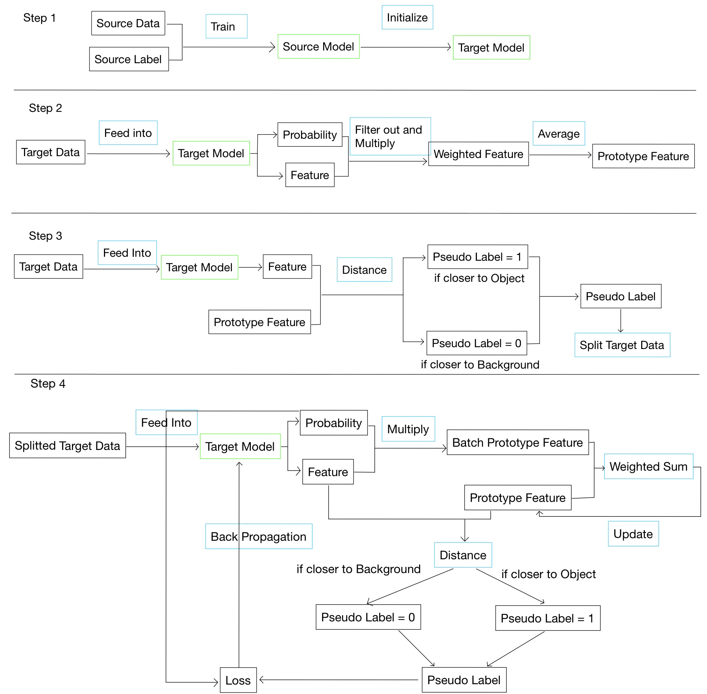
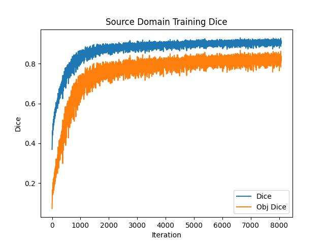
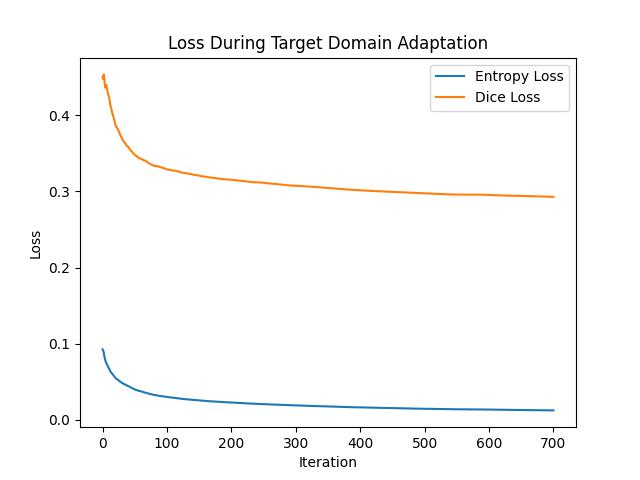
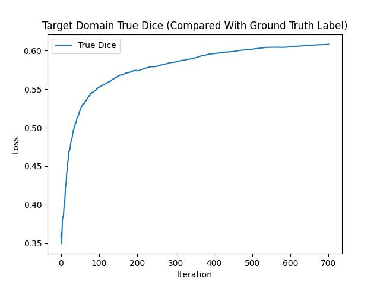
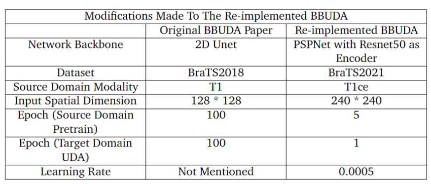

# Momentum-Prototype-Unsupervised-Domain-Adaptation

## Why Unsupervised Domain Adaptation
The traditional deep learning relies on a lot of labelled data to properly train their model, but such data is not always easy to get in medical image analysis field. Also, it's hard for a model to maintain a similar performance if it is applied to a different dataset which has significant [Domain Shift](https://www.statlect.com/machine-learning/domain-shift) compared to its training dataset. 

Unsupervised Domain Adaptation ([UDA](https://aclanthology.org/N19-1039/)) can help to alleviate these two limitations.

In UDA settings, there are two domains: the Source and the Target domain. Only the source domain has corresponding labels. A Model should perform similarly in these two domains despite their (probably large) domain shift.

## The novel Momentun Prototype UDA approach
The proposed MP-UDA is inspired by [C Chen. et al](https://arxiv.org/abs/2109.09735)'s work. MP-UDA updates the prototype features in a momentum way and uses it to construct pseudo labels for models to learn.

Compard with other UDA approaches, MP-UDA has the following two advantages:
* Source Free. The Source data is only used to train a source domain model, we do not need to access it again during target domain training. This feature makes it convinient for cross institutional co-operation as data sharing is unnecessary. All that need to be shared is a source model weight. 
* Support multiple backbones. There is no restriction to model architecture. 

MP-UDA's training procudure is illustrated as below:

It contains 4 steps:

1. Source Domain Training. Use source domain data and labels to perform a normal supervised training. The trained source domel is used to initialise target model.
2. Construct Prototype Feature. Directly feed target data into untrained target model. Filter out pixels with low probability, then multiply probablity and feature to get weighted feature. Repeat for all target data and take their average to get prototype feature. No training is performed in this step.
3. Construct Pseudo Labels and Re-split target data. Use distance measure and prototype feature to decide pseudo labels for each pixel. Use pseudo label to calculate object ratio and resplit target data into two parts: one part with a higher object ratio, and the other with a low object ratio. No training is performed in this step.
4. Target Domain Training by Momentum Update prototype features. The update equation is:$
prototype\; feature = moment \times prototype\; feature\; + \; (1 - moment)\; \times batch\; prototype\; feature$. Use updated prototype feature to calculate pseudo labels.
Loss is a combination of dice loss and entropy loss as suggested by [Liang et al](https://arxiv.org/abs/2002.08546).

## Dataset Setup
Dataset: BraTS2021.

Source Domain: T1

Target Domain: T2

Dataset split:

| Group                          | Numbers |
|--------------------------------|:-------:|
| Source Domain Training Samples |   500   |
| Target Domain Training Samples |   500   |
|            Test Set            |   125   |
|         Validation Set         |   126   |
|              Total             |   1251  |

Note: There is no overlap over Source domain training set and Target Domain training set, hence **Unsupervised**.

## Experiment Result

Result of Source Domain Pre-train:

The Source Domain Supervised Trainng performes ideal. Dice Score keeps increasing steadily.

Result of Target Domain Adaptation:

Result of Target Domain True Dice:

Based On these figures, we can conclude that our novel method works, it does overcome domain shift.

## Result Visualisations
Here are 10 validation set samples. Each gif picture shows 3 3D images: the ground truth, source model predictions, and target model predictions.

## Comparison with SOTA
|         Model         | Whole Tumor Dice | Tumpr Core Dice | Enhancing Tumor Dice |
|:---------------------:|:----------------:|:---------------:|:--------------------:|
|      Source Only      |       0.374      |      0.358      |         0.379        |
|         MP-UDA        |       0.667      |      0.614      |         0.626        |
| SOTA (re-implemented) |       0.673      |      0.613      |         0.627        |
| SOTA (original paper) |       0.763      |      0.373      |         0.396        |

As can be noted, there is a huge gap between the original SOTA and my re-implemented SOTA, so here I listed all the modifications made during re-implementation:

